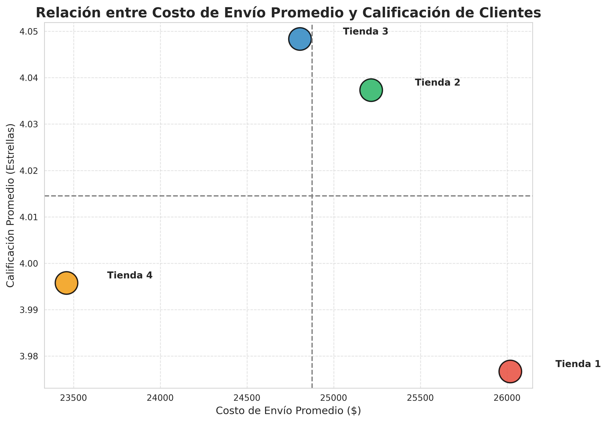
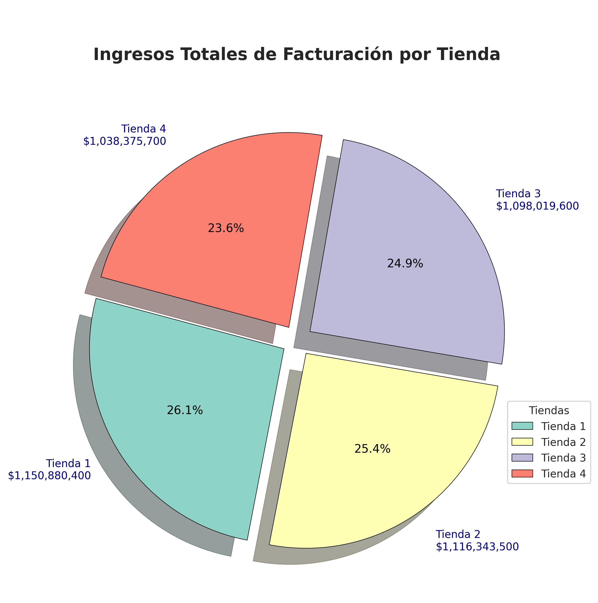
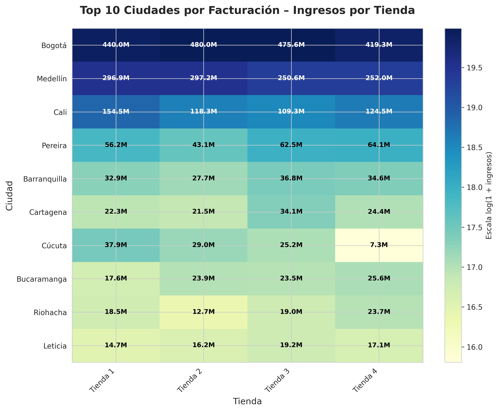
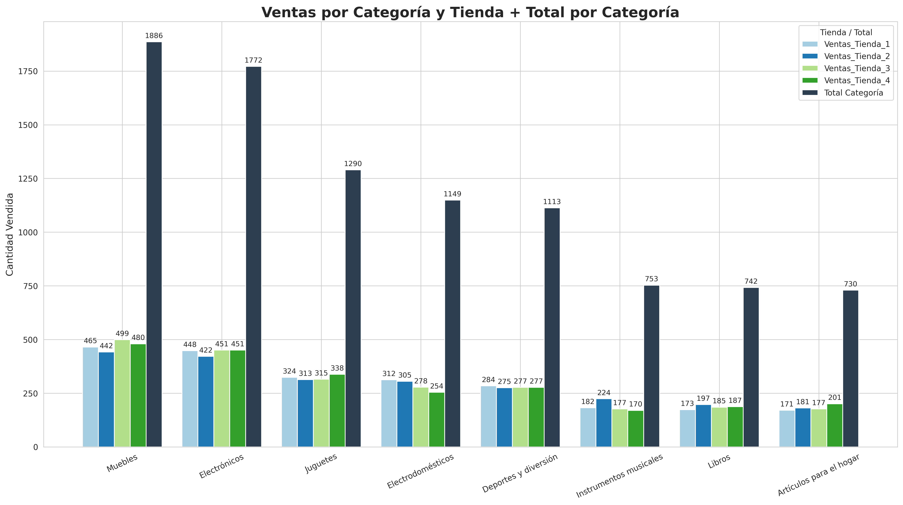

# 📊 Alura Store - Análisis de Rendimiento de Tiendas

<a href="https://colab.research.google.com/github/eppursimuove9/alura-store/blob/main/notebooks/alura_store.ipynb" target="_blank">
  
</a>

## 📋 Descripción del Proyecto

Aquí se detalla un análisis de datos a gran escala enfocado en evaluar el éxito comercial de cuatro sedes de Alura Store en Latam. El objetivo es proporcionar una visión clara del rendimiento operativo mediante métricas clave, lo que facilita el descubrimiento de opciones de optimización y guía la estrategia de negocio. El modelado, procesamiento y representación visual se programaron en Python, abordando directamente el análisis de ventas, calificaciones de clientes, costos de distribución y posicionamiento geográfico.

## 🎯 Metas del Proyecto

* Entregar el Insight necesario a Don Juan para que decida que tienda debe vender.
* Analizar la rentabilidad operativa y la facturación por sede.
* Descubrir oportunidades comerciales según la categoría de los productos.
* Monitorear la retención y el agrado del cliente mediante sus calificaciones.
* Optimizar la eficiencia de la cadena de suministro evaluando los costos de envío.
* Visualizar interactivamente la huella geográfica de las ventas.
* Diseñar estrategias corporativas basadas en inteligencia de datos.

## 📊 Métricas Analizadas

**Ingresos Totales por Tienda**
* Tienda 1: $1,150,880,400
* Tienda 2: $1,116,343,500
* Tienda 3: $1,098,019,600
* Tienda 4: $1,038,375,700

**Calificación Promedio de Clientes**
* Tienda 3: 4.05 ⭐
* Tienda 2: 4.04 ⭐
* Tienda 4: 4.00 ⭐
* Tienda 1: 3.98 ⭐

**Costo de Envío Promedio**
* Tienda 4: $23,459.46 (más económico)
* Tienda 3: $24,805.68
* Tienda 2: $25,216.24
* Tienda 1: $26,018.61

**Categorías Más Vendidas (todas las tiendas)**
* Muebles
* Electrónicos
* Juguetes
* Electrodomésticos
* Deportes y diversión

## 📁 Estructura del Proyecto

```text
alura_store/ 
│ 
├── AluraStoreLatam.ipynb   # Notebook principal con todo el análisis 
├── README.md               # Este archivo 
├── requirements.txt 
└── assets
```

## 🚀 Cómo Ejecutar el Proyecto

### Opción 1: Google Colab (Recomendado)
* Haz clic en el badge "Open in Colab" al inicio de este README.
* El notebook se abrirá en Google Colab.
* Ejecuta las celdas secuencialmente (Runtime > Run all).

### Opción 2: Entorno Local

Clona el repositorio:
```bash
git clone [https://github.com/eppursimuove9/alura-store](https://github.com/eppursimuove9/alura-store)
cd Store
```

```bash
pip install pandas matplotlib seaborn folium jupyter
```

```bash
jupyter notebook alura-store.ipynb
```

📊 Visualizaciones Destacadas

El notebook incluye múltiples visualizaciones profesionales:











## 🔍 Principales Hallazgos (Evaluación de Portafolio)

### ✅ Fortalezas Identificadas
* **Tienda 1 (Alto Valor Comercial):** Líder indiscutible en facturación bruta con más de $1,150M, posicionándola como el activo con la mayor valoración de mercado.
* **Tienda 3 (Excelencia en Servicio):** Presenta el mejor equilibrio operativo y la calificación promedio más alta por parte de los clientes (4.05 estrellas).
* **Tienda 4 (Eficiencia Logística):** Destaca por tener los costos de envío más bajos y competitivos de toda la cadena.
* **Demanda Homogénea:** Las categorías de Muebles y Electrónicos mantienen una alta rotación constante y predecible en todas las ubicaciones.

### ⚠️ Riesgos Operativos Detectados
* **Tienda 1 (Ineficiencia Oculta):** A pesar de su alto volumen de ingresos, registra los costos logísticos más altos de la cadena ($26,018 promedio) y el menor nivel de satisfacción del cliente (3.98 estrellas). Esto representa un riesgo operativo creciente a largo plazo.
* **Tienda 4 (Volumen de Ventas):** Presenta el menor nivel de facturación bruta, aunque lo compensa estructuralmente con su alta eficiencia en costos de transporte.


## 💡 Recomendación Estratégica: Venta de la Tienda 1

Considerando el objetivo principal de levantar capital para el desarrollo de un nuevo emprendimiento sin comprometer la solidez de la cadena actual, **se recomienda proceder con la venta estratégica de la Tienda 1**. 

Esta decisión corporativa se fundamenta en tres pilares:

1. **Maximización del Retorno (Cash-Out):** Al ser la sucursal con mayor nivel de ingresos históricos, asegura la valoración de mercado más alta, garantizando el flujo de capital necesario para el inversionista.
2. **Transferencia de Riesgos Operativos:** Permite desprenderse del activo con los mayores costos logísticos y problemas de retención de clientes, cediendo el desafío de optimización al nuevo comprador.
3. **Consolidación de Activos Eficientes:** El portafolio restante conservará las operaciones más sanas: la estabilidad de la Tienda 2, la alta fidelización de la Tienda 3 y la eficiencia en distribución de la Tienda 4.


